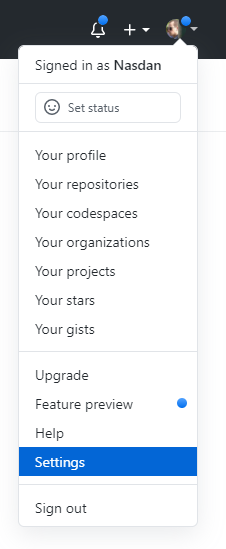
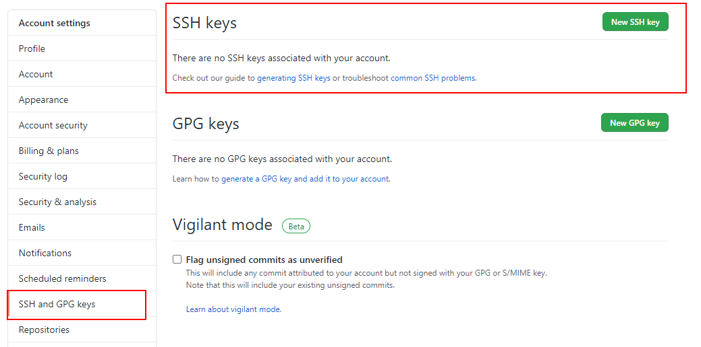
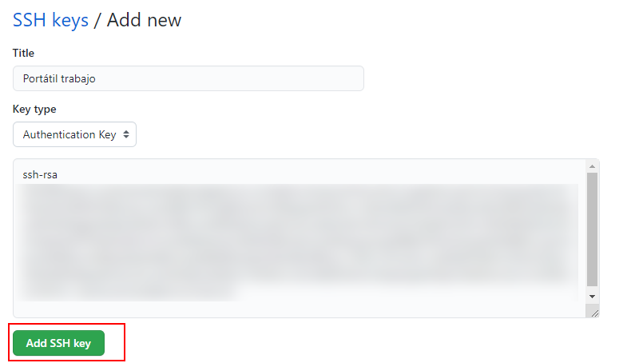
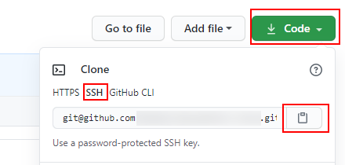
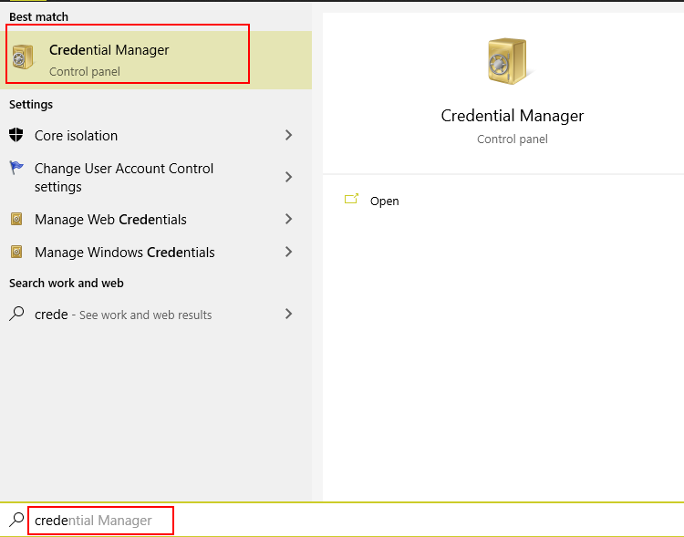
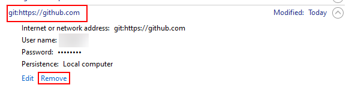

# Clave  SSH

Unha opción moi robusta para traballar con *Git* é empregar o protocolo _SSH_, a
única parte negativa é que ten un pouco máis de traballo facer o setup.

Neste caso, imos crear as nosas claves _SSH_ empregando o sistema
operativo _Windows_ e configuralas en _Github_ para poder identificarnos.

# Ao choio

Para poder xerar claves _SSH_ podemos empregar a ferramenta `ssh- keygen`,
esta ferramenta vén normalmente instalada en calquera distribución
_Linux_ ou _MacOS_ e para o caso de _Windows_, necesitaremos un terminal con _bash_ (por exemplo o terminal que vén ao instalar _git_) xa que tamén
nos instala dita librería.

Abrimos o terminal de _bash_ e executamos o seguinte comando:

```bash
ssh-keygen -m  PEM -t rsa -C <o-noso-email>

> Enter  file  in  which  to  save  the  key (/c/Users/<nome-usuario>/.ssh/id_rsa): `./id_rsa`
> Enter passphrase (empty for non passphrase): `Pulse Enter for empty`
> Enter same passphrase again: `Pulse Enter for empty`
```

Imos a diseccionar o comando que estamos a executar:

> -m PEM: é o formato para aplicar. PEM é un formato moi común para crear
> certificados de clave privada/pública.
>
> rsa: RSA é o algoritmo criptográfico a utilizar.
>
> -C: é un comentario que queiramos engadir á clave ssh, por exemplo
> o noso email.
>
> Deixaremos que garde as claves privada e pública no cartafol por 
> defecto, que é a que usará git logo para poder utilizala.
>
> Se pulsamos enter, non fai falta engadir ningún contrasinal. Aquí como
> prefiras.

Unha vez xeradas, debemos de copiar a clave pública (o ficheiro que termina
en *`.pub`*) para utilizala no noso perfil de _Github_, así cada vez que
nós utilicemos a clave privada na nosa máquina para identificarnos,
_Github_ utilizará a clave pública para poder verificar que os credenciais
usados son correctos.

En _Github_, imos a _O noso perfil_ > _Settings_ > _SSH  and  GPG  keys_ para engadir unha nova:





Imos darlle un nome para identificar a máquina onde estamos a usar esta clave
*ssh*, por exemplo, *`Portátil traballo`* e copiamos o valor da clave
pública:



Agora, podemos volver á pantalla principal do repositorio que creamos
 anteriormente, e copiar a  *URL* usando o protocolo _SSH_



Imos probalo! Podemos abrir calquera terminal na nosa máquina local
onde podamos executar os comandos de *git*. Imos repetir os pasos do
vídeo anterior para asegurarnos de que borramos todos as credenciais para
forzar a que os pida de novo:



E eliminamos as credenciais para _Github_:



Agora no terminal, clonamos o repositorio usando a url copiada:

```bash
git clone git@github.com:<nome-usuario>/<nome-repositorio>.git .

```

Pídenos que se queremos usar esa clave *ssh*, escribimos *`yes`*.

A partir de agora, non preguntará de novo pola clave _SSH_ a utilizar xa que
o apuntou no ficheiro *`C:/Users/<nome-usuario>/.ssh/known_hosts`*.

No caso de que necesitemos autenticarnos en _Github_ noutra máquina,
deberemos de repetir os pasos para poder xerar unha nova clave _SSH_.
