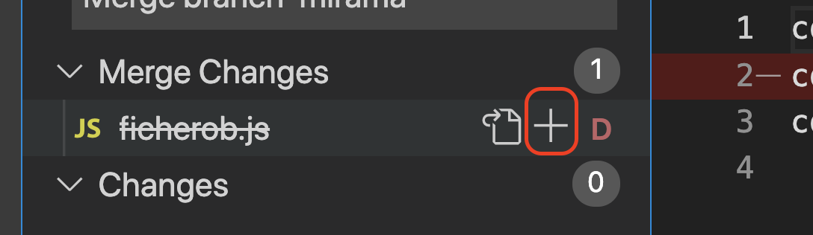

# Borrado ficheros y renombre

## Introducción

Vamos a probar otro escenario, y si...

- En máster creo dos ficheros, digamos A y B.

Y.. caso A:

- Abro una rama "mirama" y borro el fichero B.
- Mientras tanto alguien em máster modificar el fichero B.
- Es hora de hacer merge... ¿Qué pasa ahora?

O... caso B:

- Abro una rama "mirama" y modifico el fichero B.
- Mientras tanto alguien máster borra el fichero B.
- Es hora de hacer merge... ¿Qué pasa ahora?

O... caso C:

- Abro una rama "mirama" y modifico el fichero B.
- Mientras tanto alguien máster renombra el fichero B a ficheroC.
- Es hora de hacer merge... ¿Qué pasa ahora?

## Manos a la obra

Vamos a preparar un repo y haremos tres copias del mismo:

```bash
git init
```

Y creamos dos ficheros:

_ficheroa.js_

```js
console.log("*****************");
console.log("soy el fichero a");
console.log("*****************");
```

_ficherob.js_

```js
console.log("*****************");
console.log("soy el fichero b");
console.log("*****************");
```

Vamos a comitear los cambios:

```bash
git add .
```

``bash
git commit -m "primer commit"

````


Vamos crear una rama y saltar a ella

```bash
git branch mirama
````

```bash
git checkout mirama
```

> MOMENTO PAUSA, vamos a copiar esto a otra carpeta y así podemos probar facilmente los dos casos
> (todavía no estamos interactuando con un server).

### Caso A

Vamos con la primera copia, hemos dicho de borrar el _ficherob.js_

```bash
rm ficherob.js
```

Veamos el estado

```bash
git status
```

Hacemos commit

```bash
git add .
```

``bash
git commit -m "fichero borrado"

````

Hora de saltar a master:

```bash
git checkout master
````

Y vamos a modificar el _ficherob_:

_./ficherob.js_

```diff
console.log("*****************");
- console.log("soy el fichero b");
+ console.log("soy el fichero II");
console.log("*****************");
```

Hacemos commit:

```bash
git commit -am "modificado el ficherob"
```

¿Y si probamos a hacer un merge? ¿Qué va a pasar?

```bash
git merge mirama
```

Esto nos da el siguiente error:

```
Braulios-MacBook-Pro:casoA brauliodiez$ git merge mirama
CONFLICT (modify/delete): ficherob.js deleted in mirama and modified in HEAD. Version HEAD of ficherob.js left in tree.
Automatic merge failed; fix conflicts and then commit the result.
```

Vamos a ver que pasa con VSCode:

- Si nos vamos a la pestaña de git nos podemos encontrar el fichero marcado en rojo y en el area de "merge changes"
  si ponemos el ratón encima de la fila, podemos pulsar en el icono "+" y nos aparece un diálogo de confirmación en el
  que nos pregunta con que versión nos quedamos (estamos en master "ours" y queremos integrar "mirama" "them"):



Elegimos opciones y...

> Si nos hemos liado con el merge, podemos tirar para atrás y todavía no hemos comiteado poder hacer

```bash
git merge --abort
```

> Si lo ejecutamos volver a ejecutra _git merge mirama_

Cuando ya hemos elegido que queremos hacer vamos a ejecutar el commit

```bash
git commit -m "merge completado de mirama"
```

Y borrariamos la rama ya mergeada:

```bash
git branch -d mirama
```

Podemos ver que ya sólo esta _master_

```bash
git branch
```

### Caso B

Vamos a por el otro caso, cambiamos de carpeta, y en este caso:

- Parto de que estoy en _mirama_ y modifico el fichero B.
- Mientras tanto alguien máster borra el fichero B.
- Es hora de hacer merge... ¿Qué pasa ahora?

_./ficherob.js_

```diff
console.log("*****************");
- console.log("soy el fichero b");
+ console.log("soy el fichero II");
console.log("*****************");
```

Comiteamos:

```bash
git commit -m "cambio en ficherob"
```

Vamos a la rama master

```bash
git checkout master
```

Y borramos el ficheroB

```bash
rm ficherob.js
```

- Vamos a comitear los cambios:

```bash
git commit -m "fichero borrado"
```

- Hora de intentar hacer un merge...

```bash
git merge mirama
```

Conflictos... y podemos hacer como antes (Area staging y pulsar en más), esta vez el mensaje
nos avisa en el sentido contrario.

### Caso C

Veamos el resumen de este caso:

- Abro una rama "mirama" y modifico el fichero B.
- Mientras tanto alguien máster renombra el fichero B a ficheroC.
- Es hora de hacer merge... ¿Qué pasa ahora?

Vamos a por él:

Estamos en _mirama_ vamos modificar el fichero B:

_./ficherob.js_

```diff
console.log("*****************");
- console.log("soy el fichero b");
+ console.log("soy el fichero II");
console.log("*****************");
```

Hacemos commit

```bash
git commit -am "cambio texto ficherob"
```

Cambiamos a rama máster

```bash
git checkout master
```

Y vamos a renombrar el ficherob.js a fichero2.js

```bash
mv ficherob.js fichero2.js
```

Hacemos commit

```bash
git add .
```

```bash
git commit -am "ficherob renombrado a fichero2"
```

Y vamos a hacer merge de _mirama_ a _master_ a ver que pasa :)

```bash
git merge mirama -m "merge mi rama"
```

Fijate que en este caso le hemos puesto comentario, para evitar que VI
me pida el nombre del merge.

¿Cómo es esto? Pues si nos fijamos Git ha renombrado el fichero y
automaticamente añadió el contenido nuevo, ¿Es esto buena idea?
no tendría porque, para evitar posibles problemas vamos a ver la parte
de servidor y las pull request.
