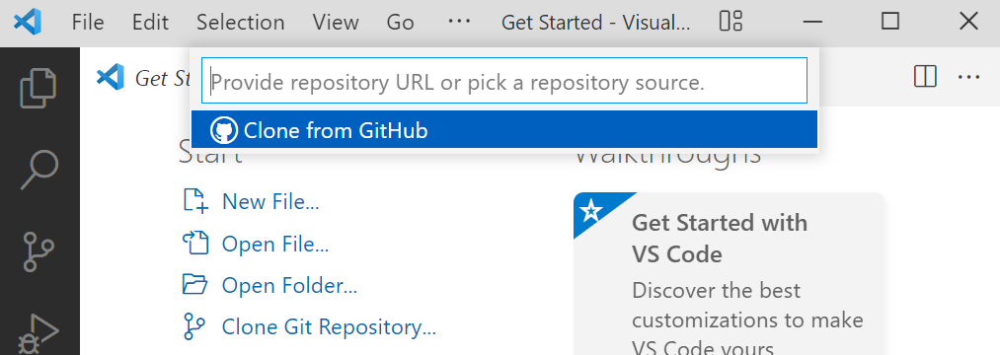
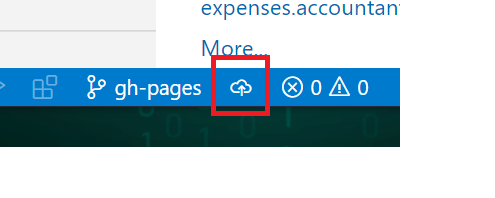

# Gh Pages

Cuando desarrollamos una librería *Opensource*,  no hay nada mejor qué tener un sitio subido en la web en la que, o bien podemos tener la documentación de nuestra librería, o mostremos una demo de nuestro código corriendo.

Github nos permite poder subir páginas de este tipo, es algo gratuito para proyecto *Opensource*.  Nuestro repo siempre tiene que ser público en caso de que fuese privado no nos funcionaría,  veamos cómo funciona:

## Pasos:

- Vamos a [*Github*](https://github.com/)
- Seleccionamos nuestro perfil y pinchamos en nuestros repositorios.


- Pinchamos en crear uno nuevo


- Creamos uno nuevo que lo podemos llamar *mytest*, le añadimos un *Readme* y que tenga Licencia de tipo *MIT License*.

​					

- Clonamos el repositorio


- Nos vamos a *Visual Studio Code*, hacemos *CTRL + SHIFT + P* o View--> Command Palette. Escribimos *Git:Clone* e introducimos la dirección del repo copiada anteriormente.



- Creamos una nueva rama llamada *gh-pages*


- Subimos esa rama a nuestro repo en *GitHub*



- Creamos un fichero HTML  y añadimos una cabecera.

*./index.html*

```html
<!DOCTYPE html>
<html lang="en">
  <head>
    <meta charset="UTF-8" />
    <meta http-equiv="X-UA-Compatible" content="IE=edge" />
    <meta name="viewport" content="width=device-width, initial-scale=1.0" />
    <title>Document</title>
  </head>
  <body>
    <h1>Hello from my test Page!</h1>
  </body>
</html>
```

- Hacemos *commit* y *push* de nuestros cambios al repositorio.


-  Si queremos navegar a esta página y ver lo que hemos desplegado sería,

```bash
<perfilgithub>.github.io/mytest
```


Esto es muy útil para subir un proyecto en vivo y mostrar la demo.