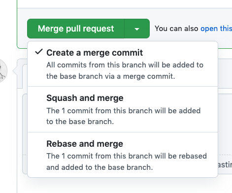

# Introducción

Cuando vamos a mezcla una pull request,
podemos elegir entre estas opciones:



¿Que diferencias tienen entre ellas?

> Aquí saltamos al PPT donde veremos como funciona esto en una secuencia
> animada

# Demo rebase

Vamos crear un directorio de trabajo, lo llamaremos _prueba2_

Linux / Mac OS

```bash
mkdir prueba2
cd prueba 2
```

Windows

```bash
md prueba2
cd prueba 2
```

Vamos a inicializar un repositorio de git dentro de esta carpeta:

```bash
git init
```

Vamos a crear un par de commits sobre máster (lo vamos a hacer
fichero a fichero, esto no tiene porque ser así, podríamos haber
creado los dos ficheros y directamente añadirlos en un commit)

_./readme.md_

```md
# Mi Proyecto

texto de prueba
```

vamos a añadir el fichero y comitearlo:

```bash
git add .
```

```bash
git commit -am "añadiendo el readme.md"
```

Vamos a hacer un segundo commit sobre master, creamos un fichero

_index.html_

```html
<!DOCTYPE html>
<html lang="en">
  <body>
    <h1>¡ Hola Mundo !</h1>
  </body>
</html>
```

Y lo commiteamos:

```bash
git add .
```

```bash
git commit -a -m "añadiendo página principal"
```

Todo bien, salimos a producción y dejamos el corte de código
que hay en producción en la rama máster, pero mientras necesitamos
seguir implementando nuevas característias, así que vamos al lio.

Nos creamos una rama para implementar nuestro caso.

```bash
git branch caso1
```

```bash
git checkout caso1
```

Vamos a ir añadiendo una segunda página a nuestro repositorio

_./prueba.html_

```html
<!DOCTYPE html>
<html lang="en">
  <body>
    <h1>Soy la página B</h1>
  </body>
</html>
```

```bash
git add .
```

```bash
git commit -am "nueva pagina"
```

De repente nos llaman y nos dicen que ha habido un "fuego", hay un
error crítico que tenemos que arreglar en la página que hay
en producción, nos toca ponernos el gorro de bombero pasarnos
a master y arremangarnos, lo bueno es que el trabajo en la ramaB
se queda como esta (si no hubieramos hecho commit tendríamos que
hacerlo, o tirar para atrás los cambios o meterlo en stash).

Vamos a pasarnos a master y nos arremangamos

```bash
git checkout master
```

Nos saltamos las reglas y metemos un commit en máster (con dos...)

_index.html_

```diff
<!DOCTYPE html>
<html lang="en">
  <body>
-    <h1>¡ Hola Mundo !</h1>
+    <h1>¡ Hola Git !</h1>
  </body>
</html>
```

```bash
git commit -am "ñapa aplicada"
```

Vemos en el arbol que nuestra rama de feature queda un commit por detras de master.

```bash
git log --oneline --decorate --graph --all
```

El commit anterior de master era justo el consecutivo de la ramaB así
que sólo hace falta mover el puntero.

Volvemos a nuestra rama caso1

```bash
git checkout caso1
```

Añadimos un nuevo fichero

_./business.js_

```js
console.log("Hello from business");
```

Lo añadimos y commiteamos:

```bash
git add .
```

```bash
git commit -a -m "Caso completo"
```

Vamos ahora a hacer un rebase de máster a mi rama.

Antes, voy a abrir dos terminales:

En este voy a dejar el arbol para que lo veamos:

```bash
git log --oneline --decorate --graph --all
```

> OJO ABRIR UN NUEVO TERMINAL

Ahora en el segundo terminal voy a hacer un rebase:

```bash
git rebase master
```

Y mira como queda el arbol ahora:

```bash
git log --oneline --decorate --graph --all
```

Si te fijas los ids de los commits han cambiado

Y ahora que todo esta controlado podríamos, podemos hacer un merge
fast forward.

```bash
git checkout master
```

```bash
git merge micaso1
```
