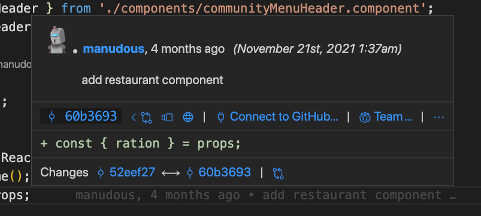

# Introducción

VS Code trae un soporte a Git que está muy bien, es una herramienta minimalista
enfocada en tu día a día.

Si trabajas en un proyecto grande, habrás echado de menos más funcionalidad,
por ejemplo:

  - Poder ver la lista de ramas, y demas.
  - Poder ver quien ha hecho una modificación directamente en código.
  - Poder navegar por el historial de commits
  - ...

# Pasos

- Lo primero que hacemos es irnos a la sección de plugins e instalar gitlens.
- Vamos a abrir un repo real (por ejemplo bar-io).

- Aquí podemos ver en la pestaña de git que nos han salido nuevas opciones,
vamos a ver que trae.

- Ahora vamos abrir un fichero (por ejemplo pod restaurant component):

Fijate que si vamos navegando por el código nos van apareciendo pistas
de quien ha hecho quien, esto es muy util, y...

Si ponemos el ratón por encima de una de estas pistas podemos ver el 
cambio introducido por ese autor :-@

Además de esto en la parte de arriba podemos navegar por el historico de commits.

