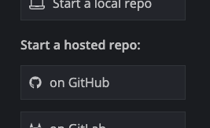
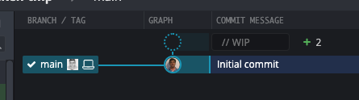
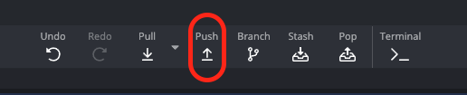
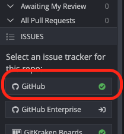
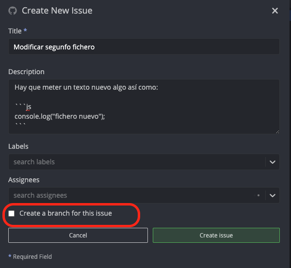
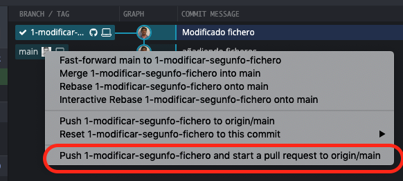
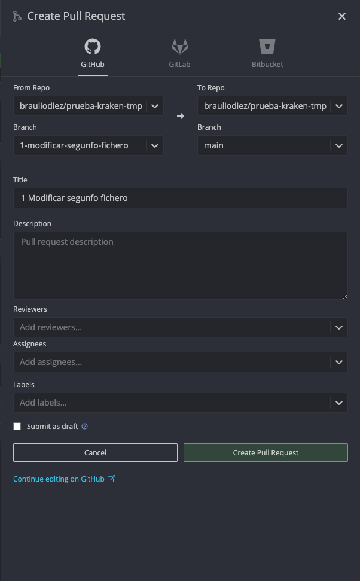
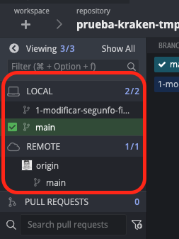
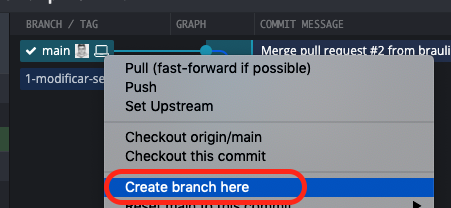

# Introducción

Vamos a ver un cliente de UI gratuito para proyectos open source y
de pago para proyectos comerciales.

Esta tool es muy potente y se integra con los principales proveedors
de git en la nube así como herramientas de gestión de issues tales
como Github, Jira, Trello...


# Pasos

En la instalación nos va a pedir nuestros datos de contacto, y nos da
también la opcíon de enlazar la tool con nuestra cuenta de Github, esto
nos va a permitir podar crear pull requests directamente desde git kraken,
o asociar issues.

https://www.gitkraken.com/

Vamos a arrancar por clonar un repositorio, directamente lo podemos hacer
desde GitKraken



Ya lo tenemos credo y podemos ver nuetro initial commit en git kraken.

Si echamos un ojo a la parte derecha de la pantalla podemos ver nuestro
working directory, podemos pinchar en los ficheros, ver las diferencias
con commits anterior e incluso editarlos(esto puede estar bien para una actualización rápida, pero lo ideal es usar nuestro editor favorito para esto),
pinchamos de nuevo para volver a la vista de arbol.

Vamos a repetir el flujo de creacíon de ramas y conflictos de uno de los 
ejemplos que vimos a ver que tal podría funcionar esto, incluida la creación de
issues.

Creamos dos ficheros en VSCode

```js
console.log("*****************");
console.log("soy el fichero a");
console.log("*****************");
```

_ficherob.js_

```js
console.log("*****************");
console.log("soy el fichero b");
console.log("*****************");
```

Vamos a hacer commit de ese cambio en gitkraken

Si te fijas justo encima del commit aparece un circulo punteado y 
un mensaje que pone "wip", también nos indica que hay dos cambios



Si pinchamos enel commit en la parte derecha podemo ver los cambios, y 
podemos mandar los cambios a staging y commitearlos.

Vamos a añadir un comentario al commit y comitear los cambios.

Si queremos hacer push de los cambios podemos clickar en la barra 
de herramientas principal de la aplicación.



Siguiente paso, queremos crear un caso y rama en
github para modificar el segundo fichero,
para ello en la parte izquierda podemos irnos
a la sección de issues y pinchar en github:



Y desde ahí mismo crear el issue, no te hace
falta irte a la web, y podría directamente crear
una rama para este issue 



> Note tenemos que darle al intro en el 
panel principal para que se cree

Vamaos a hacer un pull.

ahora podemos ver que tenemos las dos, vamos
modificar el segundo fichero:

_ficherob.js_

```diff
console.log("*****************");
- console.log("soy el fichero b");
+ console.log("soy el fichero modificado");
console.log("*****************");
```

Si volvemos a Gitkraken podemos ver el commit pendinete de subir, pinchamos sobre él y en el panel derecho vamos a añadir a staging, comitear
y después pushear (ojo tenemos que meter el mensaje
a comitear).

Hasta aquí todo bien ahora queremos mezclar a master, esto lo podemos hacer tirando de drag and drop:

  - Podemos arrastrar la rama a la rama main y
  elegir:
    - Si hacer un merge.
    - Si levantar una PR sin pasar por Github.

Vamos a elegir crear una PR





Si te fijas no tenemos la rama en servidor
ni pushead, y automaticamente nos pregunta
para crear en server, y acto seguidos nos aparece el dialogo de creación de PR:



Si nos vamos a Github podemos ver la PR 
creada, también podemos verla desde el panel
lateral de GitKraken, incluso podríamos 
mezclarla desde el propio Gitkraken.

Si queréis vamos a simular que otro desarrollador
la esta viendo desde la web y la mezclamos desde
allí.

Si esperamos un poco podemos ver como a los 
pocos segundos se nos actualiza el UI con los
nuevos cambios sin tener que hacer nada.

Vamos a ver como resolver conflictos, esta
vez nos pondremos a crear ramas sin crear issues.


Podemos irnos a la sesion de ramas y elegir la
rama main, podemos hacer pull para
asegurarnos que tenemos la última versión:



Vamos a crear una nueva rama, botón derecho
sobre la cabeza de rama y crear nueva rama.



Y creamos una rama que vamos a llamar 
"otrocambio".

Vamos a cambiar el fichero a esta vez:

_./src/ficheroa.js_

```diff
console.log("*****************");
- console.log("soy el fichero a");
+ console.log("soy el fichero I");
console.log("*****************");
```

Y hacemos commit, me muevo arriba y panel derecho,
podría también pushear (Barra de herramientas).

Volemos a master (panel izquierdo) y modificamos el _ficheroa.js_
también

```diff
console.log("*****************");
- console.log("soy el fichero a");
+ console.log("Buscando conflictos");
console.log("*****************");
```

Y commiteamos...

Ahora vamos a arrastrar la rama otrocambio a 
main y elegimos mezclar.

Nos aparece un error tenemos merge conflicts, y 
en la parte derecha podemos ver la lista, vamos a ir resolviendo pinchando en cada fichero, gitkraken
tiene su propia merge tool, vamos a elegir
la opción B para tirar para adelante.

todo resuelto listo para comitear.

Para terminal vamos a echarla un vistazo a la
terminal que ofrece GitKraken:

Pinchamos en la barra de herramientas en la
opcíon _terminal_ y podemos ver un terminal
con un punto de intellisense algo limitado mientras escribmos, por ejemplo si queremos mostrar el _git log_ los parametros no lo vamos diciendo


